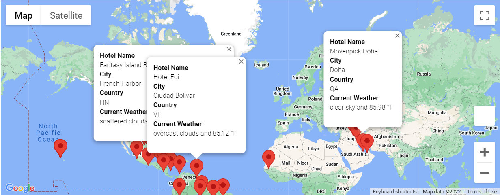
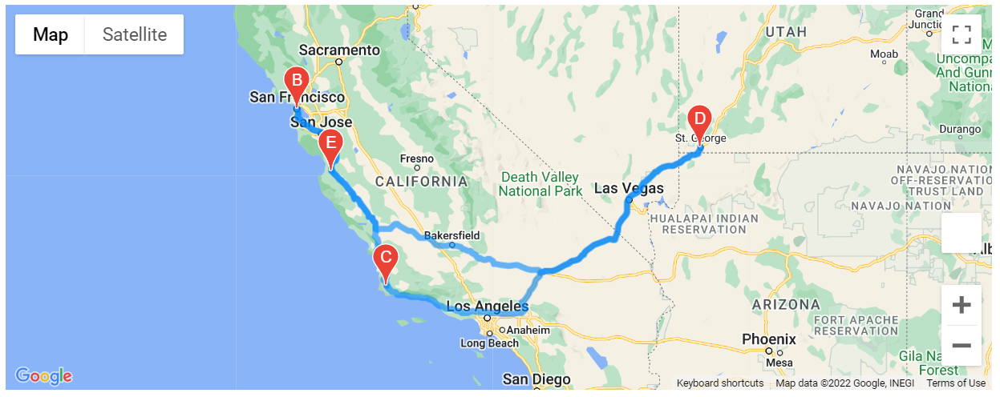
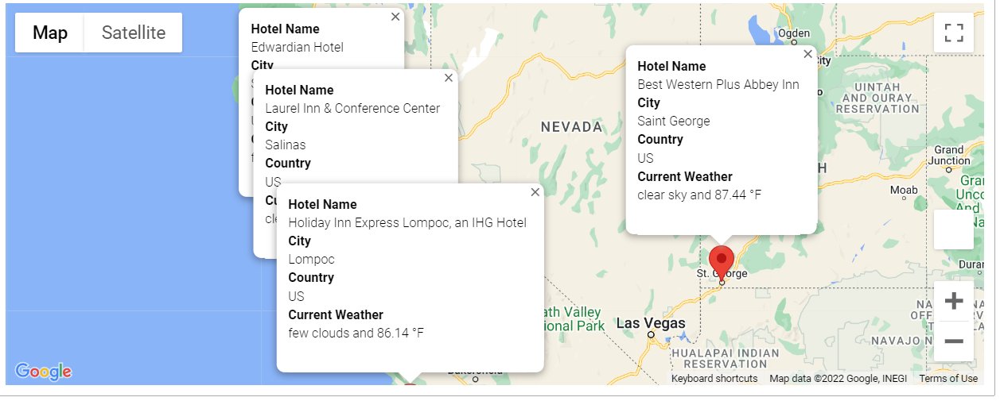

# World_Weather_Analysis

## Overview of Project
Collect and present data for customers via the search page, which they will then filter based on their preferred travel criteria in order to find their ideal hotel, anywhere in the world.
 
## Resources
Software: Python, Jupyter Notebook

Modules: CitiPy, Pandas, Matplotlib

APIs: OpenWeatherMap, Google Places API

## Summary
Create a list of more than 500 cities from a list of 2000 random latitudes and longitudes. Perform requests on the OpenWeatherMap API and retrieve the JSON weather data from these cities and add that to a Pandas data frame. Use the weather data to choose the best cities for vacation based on certain weather criteria, and then map these cities using Jupyter and the Google Places API.

## Examples
Examples of vacation mapping:

#### Vacation Map

#### Travel Map

#### Hotel Map
